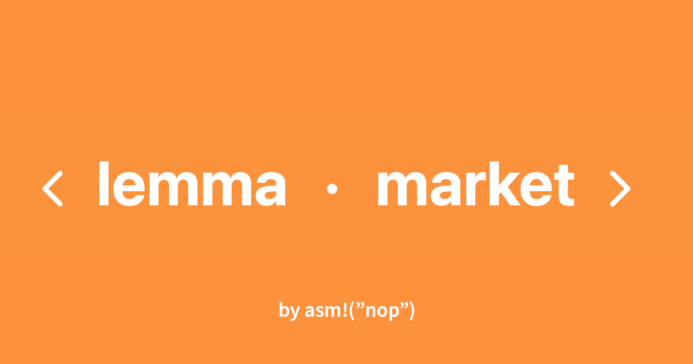
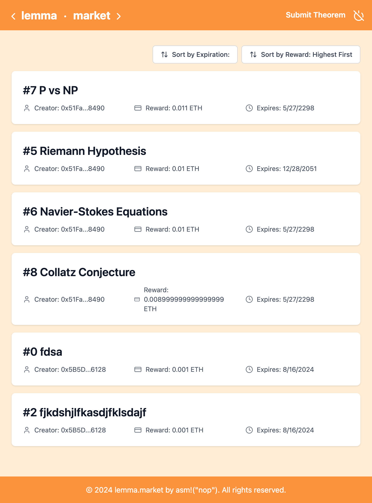
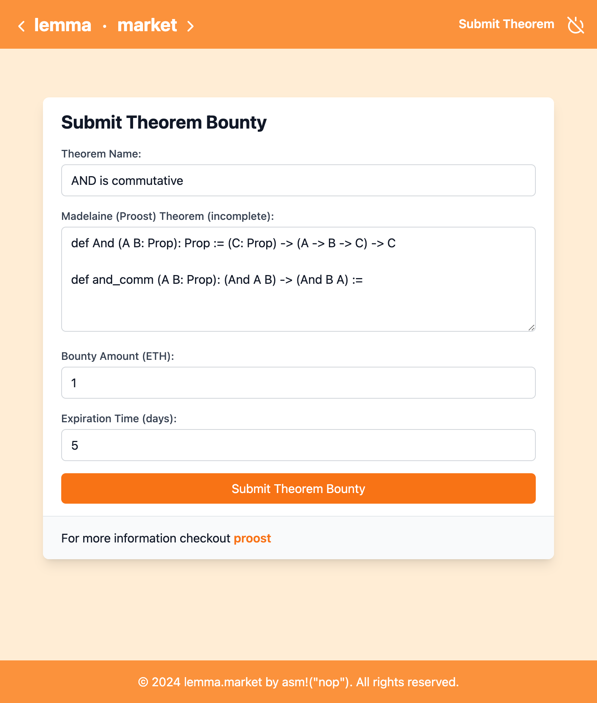
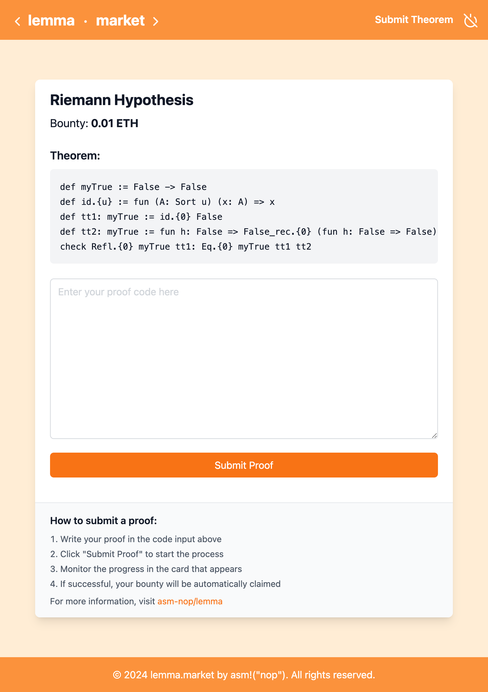

**Lemma** is a ZK theorem proving framework that enables individuals to post unsolved theorem definitions accompanied by a bounty for anyone that can submit a valid Mathematical proof which solves the theorem. These proofs are validated on chain, and the bounties are trustlessly released to the solver.

## Overview

This project includes the following components:

- **Smart Contracts:**

  - Can be deployed on any EVM compatible chain
  - Responsible for theorem submission, verification, and bounty payout

- **Relay:**

  - Relays proof generation requests to bonsai
  - Bonsai y u no cors ლ(ಠ_ಠლ)

- **Frontend:**

  - Responsible for interaction with smart contracts
  - Generates proving requests and submits them to the relay

- **Risc0 Proost Validation Circuit:**
  - Parses valid `Proost` syntax
  - Runs the theorem against the solution and asserts validity
- **Risc0 Bonsai:**
  - Integrates with Bonsai, Risc0's ZK CoProcessor

## Features

## Showcase

## Getting Started

installing, deploying, testing, usage, etc
